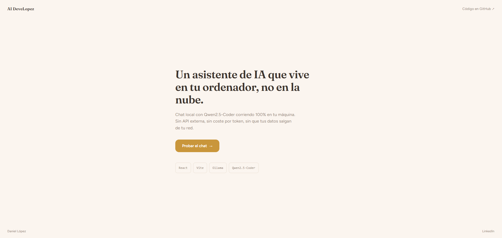
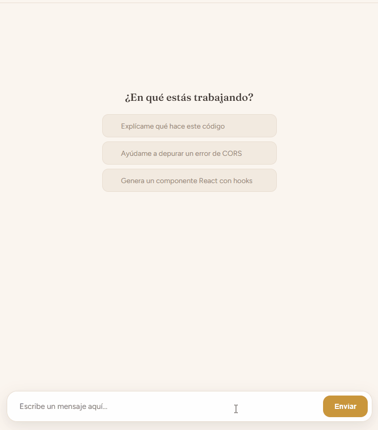
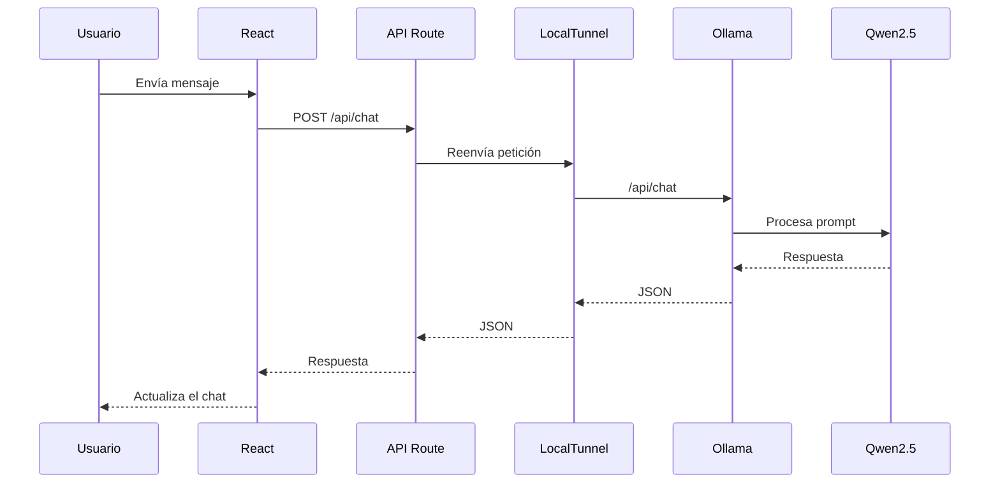

<div align="center">

# 🤖 LopezDevChat

### Explorando la integración de modelos de lenguaje locales en aplicaciones modernas

Aplicación desarrollada para investigar cómo integrar un **LLM ejecutándose en local** dentro de una arquitectura real utilizando **React**, **ASP.NET Core** y **Ollama**.

# 📸 Vista previa



<br>


</div>

---

## 📑 Índice

- [Objetivo del proyecto](#-objetivo-del-proyecto)
- [¿Por qué IA local?](#-por-qué-ia-local)
- [Arquitectura](#️-arquitectura)
- [Flujo de funcionamiento](#-flujo-de-funcionamiento)
- [Tecnologías](#-tecnologías)
- [Configuración](#️-configuración)
- [Instalación](#-instalación)
- [Decisiones de diseño](#-decisiones-de-diseño)
- [Lo aprendido](#-lo-aprendido)

# 🎯 Objetivo del proyecto

Cuando empecé este proyecto no quería construir otro chatbot.

Internet está lleno de ejemplos donde una aplicación envía un mensaje a ChatGPT y muestra la respuesta en pantalla. Aunque son útiles para aprender, sentía que ese enfoque desaprovechaba el verdadero potencial de los modelos de lenguaje.

Mi objetivo era responder a una pregunta diferente:

> **¿Puede un modelo de IA ejecutándose completamente en local convertirse en un componente más de una aplicación?**

La respuesta terminó siendo mucho más interesante de lo que esperaba.

Durante el desarrollo descubrí que un LLM no tiene por qué limitarse a responder preguntas.

Puede convertirse en un componente inteligente capaz de interpretar lenguaje natural, generar respuestas contextualizadas y producir información estructurada lista para ser consumida por otras aplicaciones.

Este proyecto nace precisamente para investigar esa idea.

---

# 💡 ¿Por qué IA local?

La mayoría de aplicaciones actuales basan su funcionamiento en servicios externos como OpenAI, Gemini o Claude.

Ese enfoque funciona muy bien, pero también implica ciertas limitaciones:

- Dependencia de terceros.
- Costes por uso de API.
- Necesidad de conexión a Internet.
- Envío de información potencialmente sensible a servidores externos.

Con **Ollama** es posible ejecutar modelos de lenguaje directamente en el equipo del desarrollador, obteniendo un control absoluto sobre la infraestructura.

Este proyecto demuestra cómo integrar ese modelo local dentro de una arquitectura web moderna.

---

# 🚀 ¿Qué demuestra este proyecto?

Más que un chatbot, este proyecto pretende demostrar cómo un modelo de lenguaje puede integrarse como un servicio dentro de una aplicación web.

Para ello se ha diseñado una arquitectura ligera donde React se comunica con una **API Route de Vercel**, que actúa como capa de integración entre la interfaz y el modelo de IA ejecutándose en local mediante **Ollama**.

El flujo de comunicación es el siguiente:

```text
Usuario
      │
      ▼
Frontend (React)
      │
      ▼
API Route (Vercel)
      │
      ▼
LocalTunnel
      │
      ▼
Ollama
      │
      ▼
Qwen2.5-Coder
      │
      ▼
Respuesta
      │
      ▼
React
```


Aunque en esta aplicación el resultado se presenta como una conversación, exactamente la misma arquitectura puede utilizarse para:

- Analizar documentos.
- Clasificar incidencias.
- Interpretar mensajes de clientes.
- Extraer información estructurada.
- Automatizar procesos.
- Asistir a operadores.
- Generar respuestas inteligentes.
- Crear herramientas internas basadas en IA.

Ese fue el verdadero aprendizaje obtenido durante el desarrollo.

---

# ✨ Características

✔ Modelo de lenguaje ejecutándose completamente en local mediante Ollama.

✔ Sin dependencias de APIs comerciales de IA.

✔ Interfaz desarrollada con React y Vite.

✔ Integración mediante API Routes de Vercel.

✔ Comunicación con Ollama a través de LocalTunnel durante el desarrollo.

✔ Arquitectura desacoplada entre la interfaz y el modelo de IA.

✔ Configuración mediante variables de entorno.

✔ Fácil sustitución del modelo de lenguaje sin modificar la interfaz.

✔ Proyecto orientado a comprender la integración de LLMs dentro de aplicaciones reales.

---

# 🎥 Demostración

> 📌 **Añadir aquí un GIF mostrando una conversación completa.**

```

```

---

# 📖 Motivación

Este proyecto cambió completamente mi forma de entender la inteligencia artificial.

Antes de comenzar pensaba en un LLM como un asistente conversacional.

Sin embargo, durante el desarrollo descubrí que su mayor valor aparece cuando deja de ser un chatbot y pasa a formar parte de la lógica de una aplicación.

En lugar de responder únicamente a preguntas, un modelo de lenguaje puede:

- Comprender lenguaje natural.
- Interpretar información.
- Detectar patrones.
- Clasificar contenido.
- Resumir textos.
- Generar estructuras JSON.
- Automatizar procesos repetitivos.

En otras palabras, un LLM puede convertirse en otro servicio más del backend.

Ese cambio de perspectiva fue precisamente el objetivo de este proyecto.

# 🏗️ Arquitectura

La aplicación sigue una arquitectura desacoplada donde la interfaz de usuario nunca se comunica directamente con el modelo de lenguaje.

En su lugar, todas las solicitudes pasan por una **API Route**, que actúa como capa de integración entre el cliente y el servicio de IA.

flowchart LR

subgraph Cliente

A["👤 Usuario"]

B["⚛️ React"]

end

subgraph Integración

C["▲ API Route"]

end

subgraph Infraestructura Local

D["🌐 LocalTunnel"]

E["🤖 Ollama"]

F["🧠 Qwen2.5"]

end

A --> B

B --> C

C --> D

D --> E

E --> F

F --> E

E --> D

D --> C

C --> B

B --> A
```

Esta arquitectura permite desacoplar completamente la interfaz de usuario del modelo de IA, facilitando futuras modificaciones sin afectar al frontend.

Además, la API Route actúa como punto único de entrada, evitando exponer directamente la instancia de Ollama al navegador.

# 📂 Estructura del proyecto

```
LopezDevChat
│
├── api/
│   └── chat.js                # API Route encargada de comunicarse con Ollama
│
├── public/
│
├── src/
│   ├── ChatApp/
│   │      ├── ChatApp.jsx
│   │      └── ChatApp.css
│   ├── LandingPage/
│   │      ├── LandinPage.jsx
│   │      └── LandingPage.css
│   ├── App.jsx
│   ├── main.jsx
│   ├── theme.css
│   ├── transition.css
│   └── index.css
│
├── docs/
│   ├── banner.png
│   ├── demo.gif
│   └── screenshots/
│
├── .env
├── package.json
└── vite.config.js
```

> **Nota:** La estructura puede variar ligeramente a medida que evolucione el proyecto.

# 🔄 Flujo de funcionamiento

Cada mensaje enviado por el usuario sigue el siguiente recorrido:

```text
1. El usuario escribe un mensaje.

        │

        ▼

2. React envía una petición HTTP POST.

        │

        ▼

3. La API Route recibe la conversación.

        │

        ▼

4. La API Route reenvía la petición a Ollama utilizando LocalTunnel.

        │

        ▼

5. Ollama ejecuta el modelo Qwen2.5-Coder.

        │

        ▼

6. El modelo genera una respuesta.

        │

        ▼

7. La API devuelve la respuesta al frontend.

        │

        ▼

8. React actualiza la conversación.
```

Todo el flujo está desacoplado, por lo que el frontend nunca necesita conocer dónde ni cómo se ejecuta el modelo.

# 🌐 ¿Por qué LocalTunnel?

Uno de los principales retos de este proyecto era que el modelo de lenguaje se ejecuta completamente en mi equipo mediante Ollama.

Sin embargo, la aplicación estaba desplegada y necesitaba acceder a ese modelo local.

Para resolver este problema utilicé **LocalTunnel**, creando un túnel temporal que expone únicamente el endpoint necesario para que la aplicación pueda comunicarse con la IA durante el desarrollo.

```text
Internet
      │
      ▼
LocalTunnel
      │
      ▼
Ollama
      │
      ▼
Modelo Local
```

Gracias a esta solución fue posible mantener el modelo ejecutándose únicamente en local sin necesidad de desplegar servidores adicionales.

# ⚙️ Configuración

El proyecto utiliza variables de entorno para evitar exponer información sensible dentro del código fuente.

Ejemplo:

```env
OLLAMA_TUNNEL_URL=https://xxxxxxxx.loca.lt
```

La API Route utiliza esta variable para localizar la instancia de Ollama sin que el frontend conozca su dirección.

De esta forma es posible cambiar el entorno de ejecución sin modificar el código de React.

# 📦 Instalación

Clonar el repositorio

```bash
git clone https://github.com/Deve-Lopez/LopezDevChat.git
```

Entrar en el proyecto

```bash
cd LopezDevChat
```

Instalar dependencias

```bash
npm install
```

Crear el archivo `.env`

```env
OLLAMA_TUNNEL_URL=https://xxxxxxxx.loca.lt
```

Iniciar el servidor de desarrollo

```bash
npm run dev
```

Asegurarse de que:

- Ollama está en ejecución.
- El modelo está descargado.
- LocalTunnel está activo.

# 🧠 Decisiones de diseño

Durante el desarrollo intenté aplicar el mismo tipo de decisiones que pueden encontrarse en una aplicación real.

| Decisión | Motivo |
|----------|--------|
| **React + Vite** | Desarrollo rápido, modular y con una excelente experiencia durante el desarrollo. |
| **API Route de Vercel** | Evita exponer directamente el modelo al cliente y centraliza la comunicación. |
| **Ollama** | Permite ejecutar modelos de lenguaje completamente en local sin depender de APIs comerciales. |
| **Qwen2.5-Coder** | Modelo ligero, rápido y suficientemente capaz para este tipo de pruebas de integración. |
| **LocalTunnel** | Hace posible que una aplicación desplegada pueda acceder a un modelo que se ejecuta únicamente en mi equipo. |
| **Variables de entorno** | Separan la configuración del código y facilitan cambiar entre distintos entornos. |

# 📊 Diagrama de secuencia

